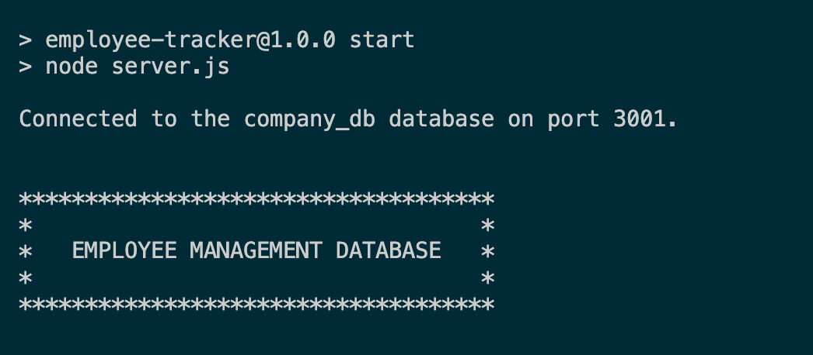

# Employee Database

## Description

This application uses MySQL, Inquirer, Console.Table and Node.js to create a dynamic database that houses employee information such as names, salaries, departments, roles and manager assignments.

## Installation

1. Download Node.js
2. Clone this repository from Github
3. Navigate to server.js. From the teriminal, type the following command:
   `npm start`. Complete the prompts to access and update an employee database.

## Usage

Click [this link](https://drive.google.com/file/d/1BlufihijOwpM0LaNX0Mj8gtbUYZFO_Bb/view) to watch a video walkthrough of the application.

## License

This project is licensed under the terms of the MIT license.

## Contact

Let's Connect! Reach me on:

- [Github](https://github.com/evanarbour)
- [LinkedIn](https://www.linkedin.com/in/evan-arbour/)
- [Email](evan.arbour@gmail.com)
